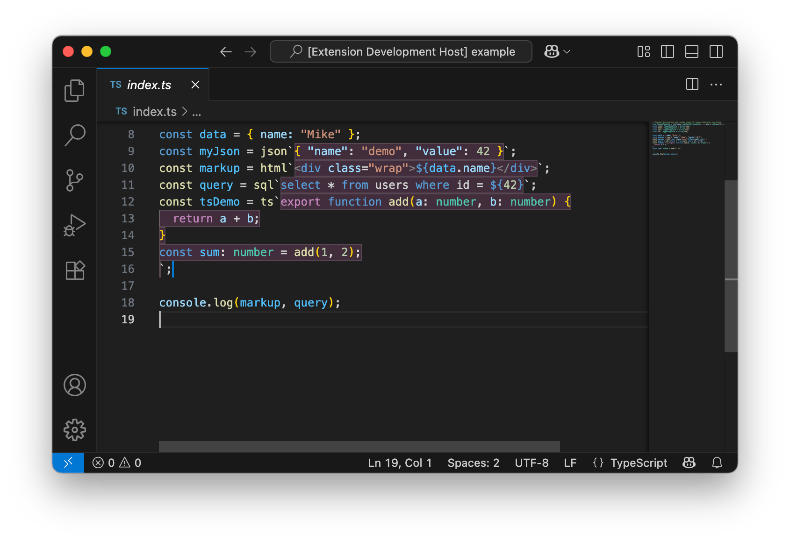

<div align="center">
  
  <h1>Tagged Templates</h1>
</div>

Syntax highlighting and subtle background tint for curated tagged template literals in JS/TS.

Editor-only: This extension only provides syntax highlighting and tinting in the editor. It never runs, evaluates, parses, or transforms your tagged template literals at runtime.



## What it does

- Highlights the content of tagged templates using the target language grammar (e.g., `json\`...\`` uses JSON).
- Adds a theme-aware background tint and optional border to embedded regions.
- Purely editor-side: zero runtime behavior or code transformation.

Supported tags (MVP): `json`, `html`, `css`, `scss`, `sql`, `graphql`/`gql`, `yaml`/`yml`, `xml`, `ts`, `sh`/`bash`.

## Usage

Open a `.ts/.tsx/.js/.jsx` file with tagged templates:

```ts
const j = json`{ "name": "mike", "version": "1.2.3" }`
const h = html`<div class="x">${x}</div>`
const q = sql`select * from users where id = ${id}`
```

### Declaring tags in your project (optional)

For runtime safety and to make your editor aware of the tags, declare simple stubs using `String.raw`. This is a great way to add named tags without changing runtime behavior (a no-op passthrough):

```ts
// e.g. src/tags.ts
export type TaggedTemplate = (strings: TemplateStringsArray, ...exprs: unknown[]) => string
export const json: TaggedTemplate = String.raw
export const html: TaggedTemplate = String.raw
export const sql: TaggedTemplate = String.raw
// add others if you use them (css, scss, graphql, yaml, xml, ts, sh, bash)
```

Then import and use them:

```ts
import { json, html, sql } from './tags'

const j = json`{ "name": "mike" }`
const h = html`<div>${j}</div>`
const q = sql`select * from t where id = ${42}`
```

All this extension cares about is the _name of the tag_ on the template literal. It's compatible with simple passthrough tags created with `String.raw` and with real tag implementations that parse/transform at runtime (for example, `gql` from [graphql-tag](https://github.com/apollographql/graphql-tag)).

If you want to use other definitions of the tagged template literals (e.g. one that actually returns JSON from a ``json`{ foo: "bar" }` ``), you can easily do so

```ts
type JsonValue = null | boolean | number | string | JsonValue[] | { [k: string]: JsonValue }

const json = (strings: TemplateStringsArray, ...exprs: unknown[]): JsonValue => {
	// Build a single string, JSON-stringifying interpolations so they embed as valid JSON fragments
	let combined = strings[0]
	for (let i = 0; i < exprs.length; i++) {
		combined += JSON.stringify(exprs[i]) + strings[i + 1]
	}

	// Allow a slightly lenient authoring style (unquoted keys, single quotes, trailing commas)
	const normalized = normalizeToStrictJson(combined)
	return JSON.parse(normalized) as JsonValue
}

function normalizeToStrictJson(input: string): string {
	let s = input
	// Quote unquoted object keys: { foo: 1, bar_baz: 2 } -> { "foo": 1, "bar_baz": 2 }
	s = s.replace(/(\{|,)\s*([A-Za-z_][A-Za-z0-9_-]*)\s*:/g, '$1 "$2":')
	// Convert single-quoted strings to double-quoted
	s = s.replace(/'([^'\\]|\\.)*'/g, (match) => {
		const inner = match.slice(1, -1).replace(/\\'/g, "'").replace(/\"/g, '"')
		return '"' + inner.replace(/"/g, '\\"') + '"'
	})
	// Remove trailing commas
	s = s.replace(/,\s*([}\]])/g, '$1')
	return s
}

// Example:
// const value = json`{ foo: "bar" }` // -> { foo: "bar" }
```

## Compatibility with real tag libraries

This extension works seamlessly with libraries that do more than simple passthrough at runtime. For example, `gql` from [graphql-tag](https://github.com/apollographql/graphql-tag) parses GraphQL strings into an AST. The extension will still inject GraphQL syntax highlighting inside the `gql\`...\`` template, because it keys off the tag name:

```ts
import gql from 'graphql-tag'

const query = gql`
  query User($id: ID!) {
    user(id: $id) { id name }
  }
`
```

## Settings

```json
"taggedTemplates.enabled": true,
"taggedTemplates.tags": { "json": "source.json", "html": "text.html.basic", ... }
```

## Color customization

Override via `workbench.colorCustomizations`:

```json
"taggedTemplates.background": "#FFFFFF14",
"taggedTemplates.border": "#FFFFFF33"
```

## Notes

- Only simple `identifier` followed by backtick is supported in MVP.
- Interpolations `${...}` are delegated back to the host language for proper highlighting.
- This extension does not evaluate, lint, or validate the embedded content; it only affects editor highlighting and tinting.

## Development

### Prerequisites

- Node.js 18+ 
- pnpm

### Setup

```bash
pnpm install
```

### Development Commands

```bash
pnpm run build      # Build the extension
pnpm run test       # Run tests
pnpm run lint       # Run ESLint
pnpm run format     # Format code with Prettier
pnpm run package    # Package extension as .vsix
```

### CI/CD

This project uses GitHub Actions for continuous integration and deployment:

#### CI Workflow (`.github/workflows/ci.yml`)
- Runs on push to `main`/`develop` branches and pull requests
- Tests against Node.js 18.x and 20.x
- Runs linting, formatting checks, building, and tests
- Packages the extension and uploads artifacts
- Performs security audits

#### Release Workflow (`.github/workflows/release.yml`)
- Triggers on version tags (e.g., `v1.0.0`)
- Builds and tests the extension
- Publishes to VS Code Marketplace
- Creates GitHub release with assets

#### Required Secrets
To enable publishing to the VS Code Marketplace, add the following secret to your GitHub repository:
- `VSCE_PAT`: Your VS Code Extension Personal Access Token from https://dev.azure.com
